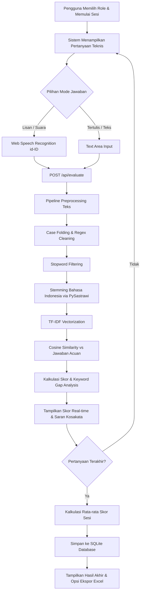

# 🎯 Intervyou.AI — Intelligent Technical Mock Interview Platform

> **Platform simulasi wawancara kerja teknis berbasis Natural Language Processing (NLP) dan Web Speech Recognition untuk evaluasi kesiapan kandidat secara real-time.**

---

## 📌 Gambaran Proyek

**Intervyou.AI** adalah platform interaktif yang dikembangkan untuk membantu talenta teknologi (*Data Scientist, Data Engineer, ML Engineer, Backend Developer, Frontend Developer, Web Developer, Mobile Developer*) dalam mempersiapkan wawancara kerja teknis. 

Sistem ini mengevaluasi respon kandidat secara objektif dengan membandingkan jawaban lisan atau tertulis terhadap bank jawaban acuan standar industri menggunakan teknik pemrosesan teks murni (*Information Retrieval & NLP*).

---

## ✨ Fitur Utama

- 🎙️ **Dual-Mode Answer Input**: Mendukung input suara lisan secara real-time menggunakan **Web Speech Recognition (id-ID)** dan input teks manual.
- 🧠 **Engine Evaluasi NLP Berbahasa Indonesia**:
  - Prapemrosesan teks lengkap: *case folding*, pembersihan simbol, penghapusan kata umum (*stopword removal*), dan stemming Bahasa Indonesia menggunakan **PySastrawi**.
  - Ekstraksi fitur dan pembobotan istilah menggunakan **TF-IDF Vectorizer**.
  - Pengukuran kesesuaian semantik menggunakan **Cosine Similarity**.
- 🔍 **Analisis Kesenjangan Kata Kunci (*Keyword Gap Analysis*)**: Mendeteksi secara spesifik istilah teknis apa yang sudah dikuasai kandidat dan konsep apa yang belum disebutkan.
- 📊 **Sistem Penilaian & Feedback Adaptif**: Menghasilkan skor kuantitatif (0–100) serta evaluasi kualitatif berdasarkan kedalaman konteks dan panjang argumen.
- 💾 **Penyimpanan Data Persisten (SQLite)**: Riwayat sesi latihan dan pencapaian pengguna tersimpan secara permanen.
- 📜 **Riwayat Sesi & Ekspor Data**: Dilengkapi navigasi paginasi riwayat serta fitur ekspor laporan ke format Microsoft Excel (`.xlsx`).
- 🎨 **Antarmuka Pengguna Modern**: Desain *dark-slate tech aesthetic* yang responsif, visualisasi cincin skor, dan tag interaktif.

---

## 🏗️ Alur & Arsitektur Sistem



---

## 🛠️ Tumpukan Teknologi

- **Backend**: Python 3.10+, Flask 3.0
- **Natural Language Processing**: Scikit-Learn (`TfidfVectorizer`, `cosine_similarity`), PySastrawi, NumPy
- **Database**: SQLite3
- **Data Export**: Pandas, OpenPyXL
- **Frontend**: Vanilla JavaScript (ES6+), HTML5 Semantik, Modern CSS (Flexbox & CSS Grid)
- **Web API**: Web Speech Recognition API

---

## 📂 Struktur Direktori

```text
Intervyou.AI/
├── app.py                  # Server Flask, routing aplikasi, dan koneksi database
├── text_scoring.py         # Modul NLP (preprocessing, TF-IDF, similarity, keyword gap)
├── answer_keys.py          # Bank kunci jawaban acuan standar per role
├── questions/              # Paket pertanyaan wawancara terstruktur
│   ├── __init__.py         # Pemetaan peran kerja
│   ├── data_scientist.py
│   ├── data_engineer.py
│   ├── ml_engineer.py
│   ├── backend_developer.py
│   ├── frontend_developer.py
│   ├── web_developer.py
│   └── mobile_developer.py
├── templates/              # Antarmuka Jinja2
│   ├── base.html
│   ├── login.html
│   ├── dashboard.html
│   ├── interview.html
│   └── history.html
├── static/
│   ├── css/
│   │   └── style.css       # Desain sistem & tema visual
│   └── js/
│       └── interview.js    # Logika Speech API & AJAX request
├── .gitignore              # Pengabaian berkas sistem dan cache
├── requirements.txt        # Dependensi pustaka
└── README.md               # Dokumentasi proyek
```

---

## 🚀 Panduan Instalasi & Menjalankan Lokal

### 1. Clone Repositori
```bash
git clone https://github.com/username-anda/Intervyou.AI.git
cd Intervyou.AI
```

### 2. Buat & Aktifkan Virtual Environment
```bash
# Windows
python -m venv .venv
.\.venv\Scripts\activate

# Linux / macOS
python3 -m venv .venv
source .venv/bin/activate
```

### 3. Pasang Dependensi
```bash
pip install -r requirements.txt
```

### 4. Jalankan Aplikasi
```bash
python app.py
```

Buka peramban (*browser*) Anda dan akses:
```text
http://localhost:7070
```

---

## 📄 Lisensi

Proyek ini dilisensikan di bawah lisensi MIT. Dikembangkan untuk portofolio dan keperluan eksplorasi sains data serta rekayasa perangkat lunak.
